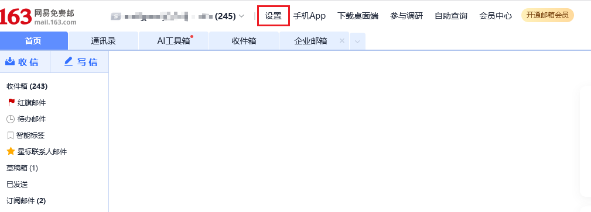
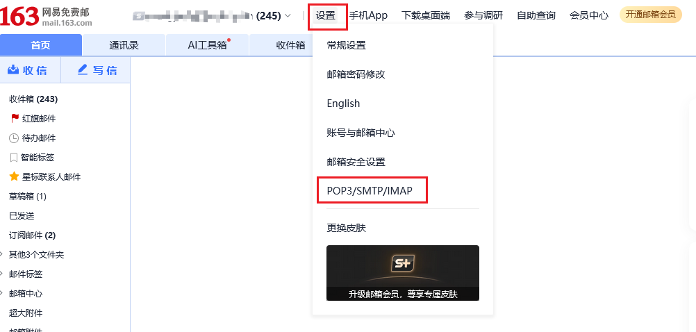
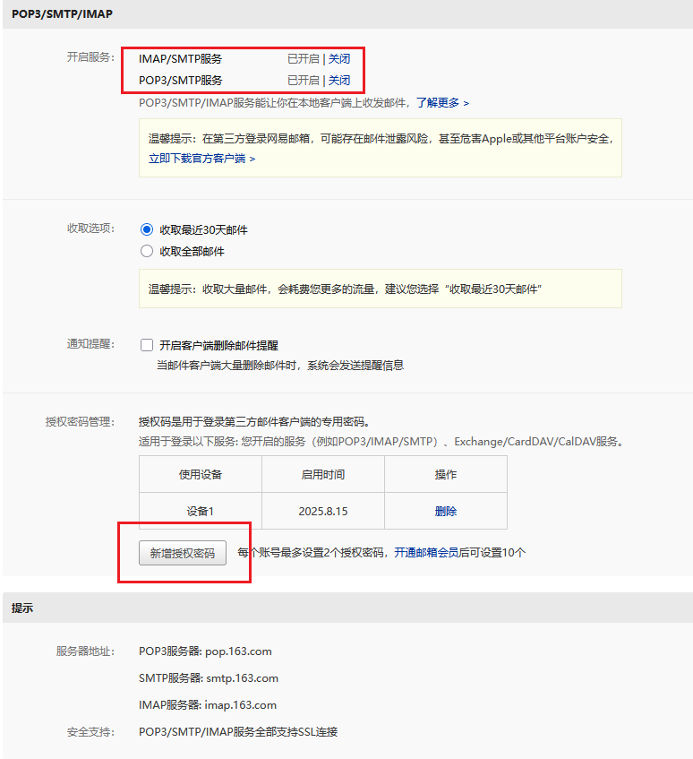
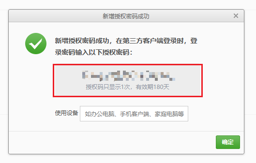

# 可选配置项

### 一、GitHub 授权登录配置

本平台支持 **GitHub 授权登录**，需要在 GitHub 中创建一个 OAuth App 并配置相关信息。

#### 配置步骤

1. 打开 [GitHub Developer settings](https://github.com/settings/developers)  
2. 登录你的 GitHub 账号  
3. 进入 **Developer settings**  
4. 左侧选择 **OAuth Apps**  
5. 点击 **New OAuth App**  
6. 填写应用信息：
   - **Application name**: 你的应用名字（随便写，例如 `LazyCraft`）
   - **Homepage URL**: 你的平台首页地址，例如：  
     ```
     http://localhost:30382
     ```
   - **Authorization callback URL**: 登录成功后的回调地址，格式如下：
     ```
     http://localhost:30382/console/api/oauth/authorize/github
     ```
     或者：
     ```
     {平台地址}/console/api/oauth/authorize/github
     ```
7. 点击 **Register application** 完成注册  
8. 注册成功后，GitHub 会生成：
   - **Client ID** → 作为 `GITHUB_CLIENT_ID` 使用  
   - **Client Secret** → 点击 **Generate a new client secret** 来生成（只显示一次，记得保存好）  

#### 环境变量配置

将生成的 `Client ID` 和 `Client Secret` 配置到环境变量中：

```bash
export GITHUB_CLIENT_ID=xxxxxxx
export GITHUB_CLIENT_SECRET=xxxxxxxx
```


### ‌二、邮箱授权码 MCP_EMAIL_PASSWORD 配置

MCP邮件服务，163邮箱配置示例

#### 配置步骤

1. ‌**登录邮箱网页版**‌：访问mail.163.com(126邮箱为mail.126.com)，输入账号密码登录；

2. ‌**进入设置页面**‌：点击右上角“设置”图标，选择“POP3/SMTP/IMAP”选项；

     

3. ‌**开启服务并验证**‌：

    - 勾选“开启IMAP/SMTP服务”或“开启POP3/SMTP服务”；

         

    - 系统会提示绑定手机并发送短信验证(需完成验证才能继续)；

         

4. ‌**生成授权码**‌：验证通过后，点击“新增授权密码”或“生成授权码”，自定义名称后保存；

     

**注意**‌：授权码仅显示一次，需立即复制或记录。

#### 环境变量配置

将生成的授权码配置到环境变量中：

```bash
export MCP_EMAIL_PASSWORD=xxxxxxx
```